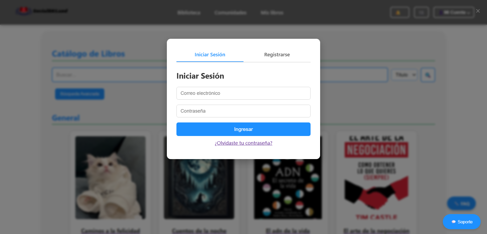
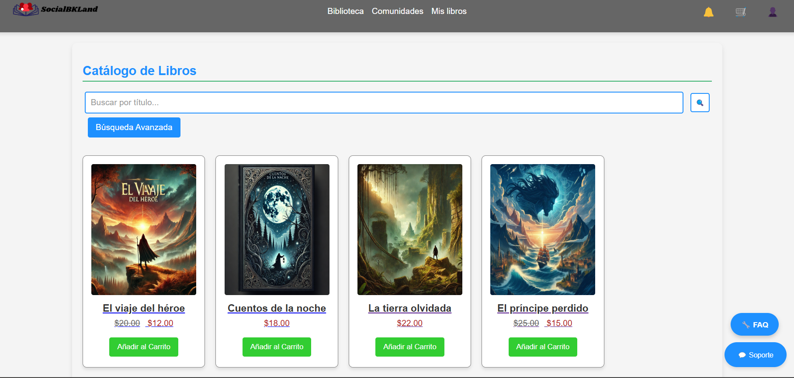
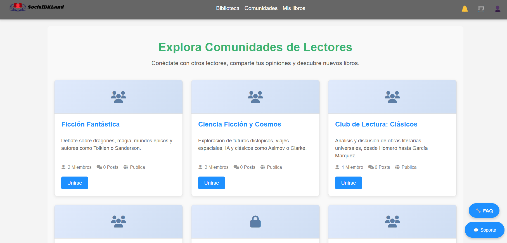
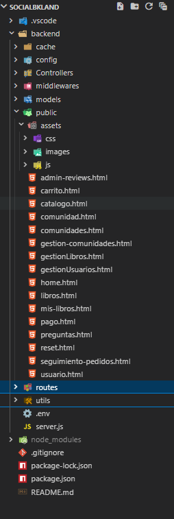

# SocialBKLand
SocialBKLand is a platform that combines e-commerce and social networking for book management and purchasing. It allows users to explore a catalog of digital and physical books, interact in reader communities, and make purchases through a simulated payment gateway.

## Content Table
  - [Demo](#demo)
  - [Features](#features)
  - [Installation steps](#installation-steps)
  - [The process](#the-process)
    - [Build with](#build-with)
    - [Structure](#structure)
  - [Useful resources](#useful-resources)
  - [License](#license)
  - [Authors](#authors)

## Demo
You can explore a preview of the system using the following demo user:

**Demo user:** `admin@example.com`  
**Password:** `admin123`

### 📸 Screenshots

#### 🔐 Login Screen


#### 📚 Library Module


#### 🧑‍🤝‍🧑 Communities View


## Features
✔️ Browse and purchase digital and physical books  
✔️ Join reader communities and discuss books  
✔️ Simulated payment gateway for transactions  
✔️ Personalized recommendations  
✔️ User authentication and profile management  
## 🛠️ Installation steps

Follow these steps to get SocialBKLand running on your machine:

### 1. Prerequisites

Make sure you have the following installed:

- [Node.js](https://nodejs.org/en/download/)  
- [MongoDB Community Edition](https://www.mongodb.com/try/download/community)  

If you don’t have them yet, download and install them from the official links above.


### 2. Clone the project

Open your terminal and run:

```
git clone https://github.com/your-username/socialbkland.git  
```
Then go to the project folder:
```
cd socialbkland/backend
```


### 3. Install dependencies

Inside the `backend` folder, run:
```
npm install
```


### 4. Start MongoDB

In case MongoDB is not already running:

- Open one terminal and run:
```
mongod
```
- Open another terminal and run:

```
mongosh
```
Keep both terminals open while using the app.


### 5. Run the server

Start the backend server by running:

node server.js

You should see a message confirming the server is running on port 5000.


### 6. Open the app

In your browser, go to:

http://localhost:5000

You’re now ready to explore **SocialBKLand**


*Note:* The default port is **5000**. If it's already in use, you can change it in the `.env` file or directly in `server.js`.

## The process
### Build with
### 🖥️ Front-end  
- JavaScript  
- CSS  
- HTML  

### 🖥️ Back-end  
- Node.js  
- JSON  

### 🛠️ IDE  
- Visual Studio Code  

### 🗄️ Base de datos  
- MongoDB  

### Structure

- The project follows a modular structure separating concerns between backend logic, static assets, and user interface modules.
It includes organized folders for configuration, routes, models, utilities, and front-end resources like styles, images, and JavaScript components.
This structure improves maintainability, scalability, and clarity during development.



## Useful resources
- [Figma](https://www.figma.com/design/0qSXFXaCtRPFy4QjuW9rHo/SocialBKLand?node-id=0-1&p=f&t=EISqFc4MZA3paGy2-0) - Used to create graphics
- [TM Notion](https://www.notion.so/) - Used to organize tasks, notes, and project documentation 
## License
Without license

## Authors

- Mateo Berrío Cardona
- Esteban Cano Ramírez
- Camilo Enoc Martínez Duque
- Mariana Montoya Sepúlveda
